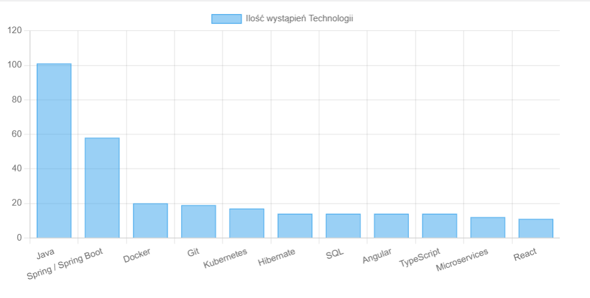

<h1 align="center"> Job offers App  </h1>

## About

A Spring Boot application that checks the required knowledge of a candidate for a job in the java category.

## Screenshots

## Resources

- [Just Join It](https://justjoin.it/all/java). Data source. 
